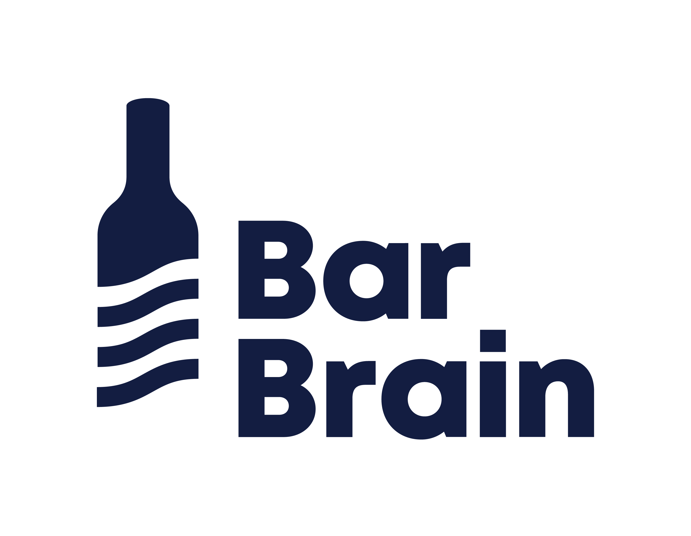

  

<h3 align="center">The fastest inventory for food & beverage</h3>

 

We're a SaaS company making inventory painless for the hospitality industry. We build tools that help bars, restaurants, and hotels count stock in half the time — no spreadsheets, no manual data entry, no post-processing headaches.

## What we build 🍸

- **Multi-device counting** — run parallel counts across iOS and Android devices at the same time
- **30,000+ product catalog** — spirits, wines, beverages, food, and housekeeping supplies, ready to go
- **Fill-level tracking** — capture opened and unopened units with precision
- **Instant reporting** — completed inventory reports the moment a count is done
- **Multi-location management** — from a single bar to an enterprise portfolio

## Who trusts us 🤝

1,000+ customers across the hospitality industry, from independent bars to brands like L'Osteria, Harry's Home Hotels, and Schloss Elmau.

## Links

🌐 [barbrain.com](https://www.barbrain.com)
· 📱 [iOS](https://apps.apple.com/app/barbrain)
· [Android](https://play.google.com/store/apps/details?id=com.barbrain)
